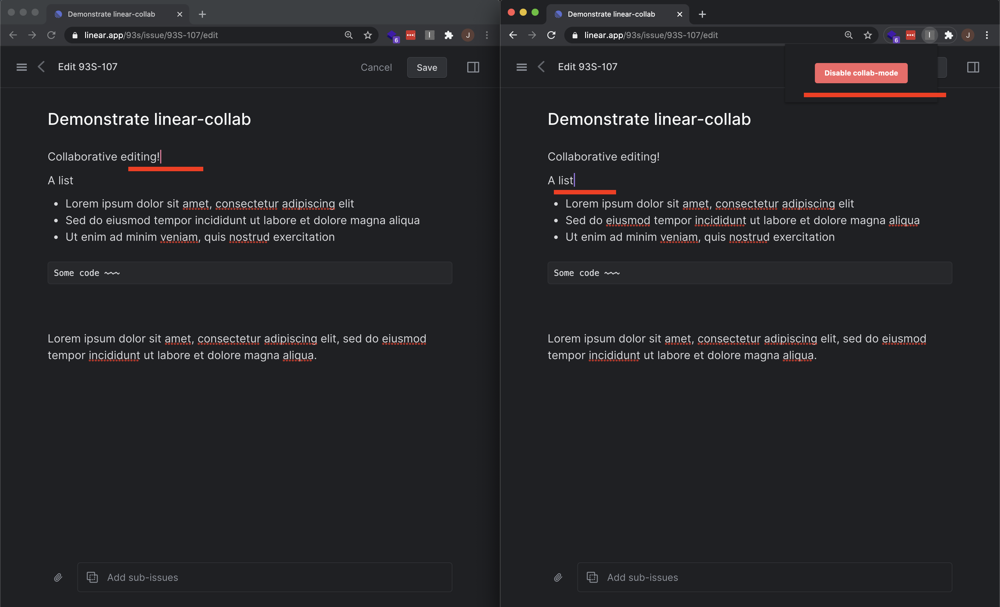

# linear-collab

A Chrome extension + web socket application that adds collaborative editing mode to Linear.

View [demo video](https://youtu.be/uLVRroxz07c).

## How it works

The `linear-collab` Chrome extension mounts a React app from a [content script](./src/content.js) onto the DOM, alongside Linear.
When it detects that the user is on an "edit issue" page (see: [`usePathState`](./src/hooks/usePathState.js)), the extension creates a DOM element that intelligently positions itself over the normal Linear editor (see: [`useElemBoundingRect`](./src/hooks/useElemBoundingRect.js)), and pulls relevant classes to maintain style consistency.
A basic [re-implementation](./src/prosemirror/Editor.js) of Linear's ProseMirror instance is used to add editing functionality, and the initial document is pulled from the actual Linear editor element.

From there, the `prosemirror-collab` module is used to synchronize the document across a transport.
I created [`ExtensionTransport`](./src/prosemirror/ExtensionTransport.js) for development, which passes messages via the extension [background script](./src/background.js).
This was to keep things simple while in development by reducing the scope of potential issues while working on the collaborative editing functionality (`ExtensionTransport` is a mere 9 SLoC).
In production, [`SocketTransport`](./src/prosemirror/SocketTransport.js) is used to send messages over the network by way of a socket server (found [here](./src/server.js)).
Each transport mode has an accompanying "relay" ([`ExtensionRelay`](./src/prosemirror/ExtensionRelay.js), [`SocketRelay`](./src/prosemirror/SocketRelay.js)) for deciding how to handle incoming messages.

I wanted to make user cursors visible as a nice touch (since it's so common in collaborative editing software, i.e. Google Docs).
This turned out to be very manageable as ProseMirror supports a useful plugin architecture.
To implement this feature, I created the [`collabCursor`](./src/prosemirror/collabCursor.js) plugin, which shares a similar usage pattern to `prosemirror-collab`.
The plugin inspects the document state and stores cursor information as transaction metadata as the user types, this state is then sent via the authority (using whichever transport mode is configured) and consumed by any listening clients.
Received cursor data is added to the document state, again by using transaction metadata, which is then used to render a custom [`cursorWidgetDecoration`](./src/prosemirror/cursorWidgetDecoration.js).

Lastly, I added a [popup menu](./src/app-menu/App.js) to the extension, with a simple button for enabling and disabling this functionality.
It uses the `chrome.storage` Chrome extension feature to sync state between multiple JS contexts (menu context and content script context, see: [`useCollabState`](./src/hooks/useCollabState.js)).

This was a great learning exercise, I'm impressed with ProseMirror and have definitely added it to my toolbox for future use.
I've created many Chrome extensions for the sake of reverse-engineering web applications, one of my favorite ways to do so is by mounting a React app from a content script (which is what is happening here).
This project resembles my [Reflix](https://github.com/jtormey/reflix) project, which also consists of a Chrome extension that hooks into a site (Netflix) and a socket syncing layer (relaying commands to a React Native iOS remote).

## What doesn't work

Implementing a feature like this without source code access is... tricky.

A glaring issue is that there's no way to actually save the document that multiple people are working on.
I briefly looked into performing a sync by reconstructing the document and calling the Linear GraphQL API with an API key, however it seemed out of scope for what I wanted to accomplish.

The cursors and document text sometimes shows interesting inconsistencies.
From what I can tell, this is because of my lack of complete understanding of ProseMirror and not enough effort put into the resolution of steps.
Given more time, I would try a system where the clients and server are in tighter cooperation, likely involving ProseMirror's `rebase` feature.

There are some minor style and structure issues, as my ProseMirror implementation does not exactly mirror that implemented by Linear.

## Technologies used

* React (context app, menu app)
* StyledComponents
* ProseMirror (+ custom plugin)
* Chrome extension (background script, context script, popup menu, `chrome.storage`)
* Express (+ Web Sockets)

## Installation

See the [releases](https://github.com/jtormey/linear-collab/releases) page.

After downloading a release build, go to [your extensions](chrome://extensions/) to install it ("Load unpacked").

## Development

* `yarn build`: Build the extension
* `yarn build:watch`: Build the extension and watch for changes
* `yarn start`: Start the socket server
* `VER=$VER yarn release`: Build a new release
